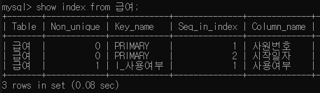
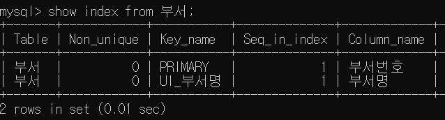
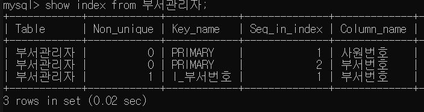
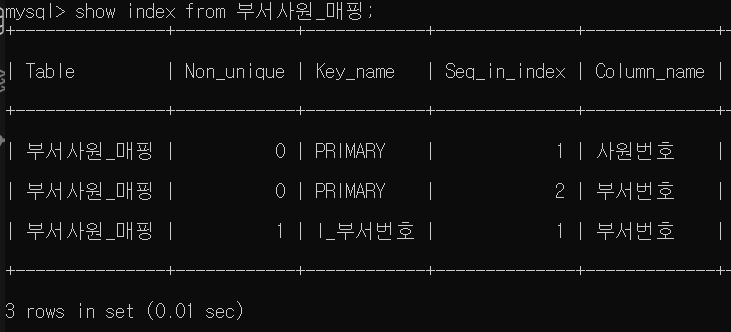
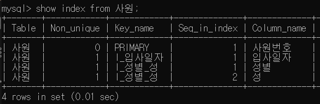
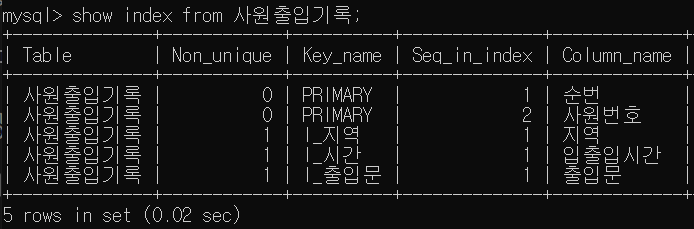
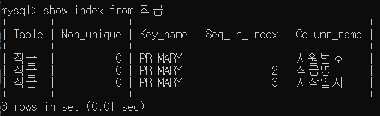

# 4장 악성 SQL 튜닝으로 초보자 탈출하기
## 4.1 SQL 튜닝 준비하기
### DB 확인
use tuning; 으로 db 준비
- 급여 테이블
``` 
mysql> select count(1) from 급여;
+----------+
| count(1) |
+----------+
|  2844047 |
+----------+
1 row in set (0.76 sec) 
```

- 부서관리자 테이블
```
mysql> select count(1) from 부서관리자;
+----------+
| count(1) |
+----------+
|       24 |
+----------+
1 row in set (0.03 sec)
```

- 부서사원_매핑 테이블
```
mysql> select count(1) from 부서사원_매핑;
+----------+
| count(1) |
+----------+
|   331603 |
+----------+
1 row in set (0.19 sec)
```

- 사원 테이블
```
mysql> select count(1) from 사원;
+----------+
| count(1) |
+----------+
|   300024 |
+----------+
1 row in set (0.20 sec)
```

- 사원출입기록 테이블
```
mysql> select count(1) from 사원출입기록;
+----------+
| count(1) |
+----------+
|   660000 |
+----------+
1 row in set (0.20 sec)
```

- 직급 테이블
```
mysql> select count(1) from 직급;
+----------+
| count(1) |
+----------+
|   443308 |
+----------+
1 row in set (0.14 sec)
```

### 테이블별 인덱스 목록
- 기본 키(Primary Key) : PK
- 고유 인덱스 (Unique Index) : UI
- 비고유 인덱스 (Non Unique Index) : I

- 급여 테이블 
    
    - PK : 사원번호 + 시작일자
    - I : 사용여부

- 부서 테이블
    
    - PK : 부서번호
    - UI : 부서명

- 부서관리자 테이블
    
    - PK : 사원번호 + 부서번호
    - I : 부서번호

- 부서사원_매핑 테이블
    
    - PK : 사원번호 + 부서번호
    - I : 부서번호

- 사원 테이블
    
    - PK : 사원번호
    - I : 입사일자
    - I : 성별 + 성

- 사원출입기록 테이블
    
    - PK : 순번 + 사원번호
    - I : 출입문
    - I : 지역
    - I : 입출입시간

- 직급 테이블
    
    - PK : 사원번호 + 직급명 + 시작일자


### SQL 튜닝 절차
SQL 문의 구성 요소
- 가시적 : 테이블 현황과 조건절, 그루핑 열, 정렬 열, Select 절의 열
- 비가시적 : 실행 계획, 인덱스 현황, 조건절 열들의 데이터 분포, 데이터의 적재 속도, 업무 특성 등
=> 다양한 요인들을 분석 후 튜닝 방향 결정
(튜닝 방향은 정해져 있지 않으므로 상황에 맞게 판단하는 시야를 길러야 함)


## 4.2 SQL 문 단순 수정으로 착한 쿼리 만들기
### 4.1.1 기본 키를 변형하는 나쁜 SQL 문

1. 조건 
- 사원 번호가 1100으로 시작
- 사원 번호가 5자리

2. 튜닝 전
    2.1 튜닝 전 SQL 문
    ```
    mysql> select * from 사원
        -> where substring(사원번호,1,4)=1100
        -> and length(사원번호)=5
        -> ;
    +----------+------------+-------------+-------------+------+------------+
    | 사원번호 | 생년월일   | 이름        | 성          | 성별 | 입사일자   |
    +----------+------------+-------------+-------------+------+------------+
    |    11000 | 1960-09-12 | Alain       | Bonifati    | M    | 1988-08-20 |
    |    11001 | 1956-04-16 | Baziley     | Buchter     | F    | 1987-02-23 |
    |    11002 | 1952-02-26 | Bluma       | Ulupinar    | M    | 1996-12-23 |
    |    11003 | 1960-11-13 | Mariangiola | Gulla       | M    | 1987-05-24 |
    |    11004 | 1954-08-05 | JoAnna      | Decleir     | F    | 1992-01-19 |
    |    11005 | 1958-03-12 | Byong       | Douceur     | F    | 1986-07-27 |
    |    11006 | 1962-12-26 | Christoper  | Butterworth | F    | 1989-08-02 |
    |    11007 | 1962-03-16 | Olivera     | Maccarone   | M    | 1991-04-11 |
    |    11008 | 1962-07-11 | Gennady     | Menhoudj    | M    | 1988-09-18 |
    |    11009 | 1954-08-30 | Alper       | Axelband    | F    | 1986-09-09 |
    +----------+------------+-------------+-------------+------+------------+
    10 rows in set (0.24 sec)
    ```
    => 소요 시간 : 약 0.24sec

    <br>

    2.2 튜닝 전 실행 계획
    ```
    mysql> explain
        -> select * from 사원
        -> where substring(사원번호,1,4)=1100
        -> and length(사원번호)=5;
    +----+-------------+-------+------------+------+---------------+------+---------+------+--------+----------+-------------+
    | id | select_type | table | partitions | type | possible_keys | key  | key_len | ref  | rows   | filtered | Extra       |
    +----+-------------+-------+------------+------+---------------+------+---------+------+--------+----------+-------------+
    |  1 | SIMPLE      | 사원  | NULL       | ALL  | NULL          | NULL | NULL    | NULL | 299733 |   100.00 | Using where |
    +----+-------------+-------+------------+------+---------------+------+---------+------+--------+----------+-------------+
    1 row in set, 1 warning (0.01 sec)
    ```

    - 사원 테이블 1개 : 1개 행
    - Type 항목 : ALL -> 테이블 풀 스캔 방식 (feat. 3.2.3을 통해 나쁜 방식임을 알 수 있음)
        인덱스를 활용하지 않고 데이터에 바로 접근 -> 필요한 범위에만 접근하지만 전부 스캔하므로 비효율적

3. 튜닝 수행

   튜닝 대상 파악

    - 데이터 수
        ```
        mysql> select count(1) from 사원;
        +----------+
        | count(1) |
        +----------+
        |   300024 |
        +----------+
        1 row in set (0.07 sec)
        ```
        -> 약 30만건의 데이터

    - 인덱스 현황
        ```
        mysql> show index from 사원;
        +-------+------------+------------+--------------+-------------+-----------+-------------+----------+--------+------+------------+---------+---------------+---------+------------+
        | Table | Non_unique | Key_name   | Seq_in_index | Column_name | Collation | Cardinality | Sub_part | Packed | Null | Index_type | Comment | Index_comment | Visible | Expression |
        +-------+------------+------------+--------------+-------------+-----------+-------------+----------+--------+------+------------+---------+---------------+---------+------------+
        | 사원  |          0 | PRIMARY    |            1 | 사원번호    | A         |      299733 |     NULL |   NULL |      | BTREE      |         |               | YES     | NULL       |
        | 사원  |          1 | I_입사일자 |            1 | 입사일자    | A         |        5277 |     NULL |   NULL |      | BTREE      |         |               | YES     | NULL       |
        | 사원  |          1 | I_성별_성  |            1 | 성별        | A         |           1 |     NULL |   NULL |      | BTREE      |         |               | YES     | NULL       |
        | 사원  |          1 | I_성별_성  |            2 | 성          | A         |        3360 |     NULL |   NULL |      | BTREE      |         |               | YES     | NULL       |
        +-------+------------+------------+--------------+-------------+-----------+-------------+----------+--------+------+------------+---------+---------------+---------+------------+
        4 rows in set (0.00 sec)
        ```
        
        -> ( PRIMARY_KEY , I_입사일자, I_성별_성 ) 3가지 인덱스 존재

        
        튜닝 전 SQL문 : 사원번호 열을 조건문으로 작성 -> 기본 키를 통해 데이터에 빠르게 접근 가능 
        
        -> but, 사원번호를 가공(substring, length)하여 사용 -> 기본 키 사용 X & 테이블 풀 스캔

        
        => 사원번호를 가공하는 방식 대신 다른 방식 채택

    4. 튜닝 결과
    
        4.1 튜닝 후 SQL문

        기본 키를 사용하기 위해 사원번호를 변형하지 않고 where 절 작성

        - between을 사용하여 범위 검색 수행

            or

        - 비교 연산자를 사용하여 범위 검색 수행

        위 두 방식으로 기본 키, 인덱스 활용 가능

        4.2 튜닝 후 수행 결과
            
            mysql> select * from 사원
            -> where 사원번호 between 11000 and 11009;
            +----------+------------+-------------+-------------+------+------------+
            | 사원번호 | 생년월일   | 이름        | 성          | 성별 | 입사일자   |
            +----------+------------+-------------+-------------+------+------------+
            |    11000 | 1960-09-12 | Alain       | Bonifati    | M    | 1988-08-20 |
            |    11001 | 1956-04-16 | Baziley     | Buchter     | F    | 1987-02-23 |
            |    11002 | 1952-02-26 | Bluma       | Ulupinar    | M    | 1996-12-23 |
            |    11003 | 1960-11-13 | Mariangiola | Gulla       | M    | 1987-05-24 |
            |    11004 | 1954-08-05 | JoAnna      | Decleir     | F    | 1992-01-19 |
            |    11005 | 1958-03-12 | Byong       | Douceur     | F    | 1986-07-27 |
            |    11006 | 1962-12-26 | Christoper  | Butterworth | F    | 1989-08-02 |
            |    11007 | 1962-03-16 | Olivera     | Maccarone   | M    | 1991-04-11 |
            |    11008 | 1962-07-11 | Gennady     | Menhoudj    | M    | 1988-09-18 |
            |    11009 | 1954-08-30 | Alper       | Axelband    | F    | 1986-09-09 |
            +----------+------------+-------------+-------------+------+------------+
            10 rows in set (0.01 sec)


            or


            mysql> select * from 사원
            -> where 사원번호 >=11000 and 사원번호<=11009;
            +----------+------------+-------------+-------------+------+------------+
            | 사원번호 | 생년월일   | 이름        | 성          | 성별 | 입사일자   |
            +----------+------------+-------------+-------------+------+------------+
            |    11000 | 1960-09-12 | Alain       | Bonifati    | M    | 1988-08-20 |
            |    11001 | 1956-04-16 | Baziley     | Buchter     | F    | 1987-02-23 |
            |    11002 | 1952-02-26 | Bluma       | Ulupinar    | M    | 1996-12-23 |
            |    11003 | 1960-11-13 | Mariangiola | Gulla       | M    | 1987-05-24 |
            |    11004 | 1954-08-05 | JoAnna      | Decleir     | F    | 1992-01-19 |
            |    11005 | 1958-03-12 | Byong       | Douceur     | F    | 1986-07-27 |
            |    11006 | 1962-12-26 | Christoper  | Butterworth | F    | 1989-08-02 |
            |    11007 | 1962-03-16 | Olivera     | Maccarone   | M    | 1991-04-11 |
            |    11008 | 1962-07-11 | Gennady     | Menhoudj    | M    | 1988-09-18 |
            |    11009 | 1954-08-30 | Alper       | Axelband    | F    | 1986-09-09 |
            +----------+------------+-------------+-------------+------+------------+
            10 rows in set (0.01 sec)
            

        소요 시간 : 0.01 sec

        4.3 튜닝 후 실행 계획

        ```
        mysql> explain
        -> select * from 사원
        -> where 사원번호 between 11000 and 11009;
        +----+-------------+-------+------------+-------+---------------+---------+---------+------+------+----------+-------------+
        | id | select_type | table | partitions | type  | possible_keys | key     | key_len | ref  | rows | filtered | Extra       |
        +----+-------------+-------+------------+-------+---------------+---------+---------+------+------+----------+-------------+
        |  1 | SIMPLE      | 사원  | NULL       | range | PRIMARY       | PRIMARY | 4       | NULL |   10 |   100.00 | Using where |
        +----+-------------+-------+------------+-------+---------------+---------+---------+------+------+----------+-------------+
        1 row in set, 1 warning (0.00 sec)
        ```

        - 1개 행으로 출력
        - type : range -> 기본 키의 특정 범위만 스캔
        - rows : 10 -> 10 값 예측 가능
    
### 4.2.2 사용하지 않는 함수를 포함하는 나쁜 SQL문

1. 조건
    
    성별 기준으로 몇 명의 사원이 있는지?
    - 성별 값이 NULL 이라면, NO DATA라고 출력하도록 IFNULL() 사용

2. 튜닝 전
    2.1 튜닝 전 SQL문
    
    ```
    mysql> select ifnull(성별, 'NO DATA') as 성별, count(1) 건수 from 사원
    -> group by ifnull(성별, 'NO DATA');
    +------+--------+
    | 성별 | 건수   |
    +------+--------+
    | M    | 179973 |
    | F    | 120051 |
    +------+--------+
    2 rows in set (0.55 sec)
    ```

    2.2 튜닝 전 실행 계획

    ```
    mysql> explain
    -> select ifnull(성별, 'NO DATA') as 성별, count(1) 건수 from 사원
    -> group by ifnull(성별, 'NO DATA');
    +----+-------------+-------+------------+-------+---------------+-----------+---------+------+--------+----------+------------------------------+
    | id | select_type | table | partitions | type  | possible_keys | key       | key_len | ref  | rows   | filtered | Extra                        |
    +----+-------------+-------+------------+-------+---------------+-----------+---------+------+--------+----------+------------------------------+
    |  1 | SIMPLE      | 사원  | NULL       | index | I_성별_성     | I_성별_성 | 51      | NULL | 299733 |   100.00 | Using index; Using temporary |
    +----+-------------+-------+------------+-------+---------------+-----------+---------+------+--------+----------+------------------------------+
    1 row in set, 1 warning (0.00 sec)
    ```
    - Key : I_성별_성 -> 인덱스 풀 스캔 
    - Extra : Using temporary -> 임시 테이블 생성


3. 튜닝 수행
    SQL 문 실행 결과,
    - 성별 : Null 값 존재 X , M/F만 존재
    - NULL NO 인 것도 확인 가능
        ```
        mysql> desc 사원;
        +----------+---------------+------+-----+---------+-------+
        | Field    | Type          | Null | Key | Default | Extra |
        +----------+---------------+------+-----+---------+-------+
        | 사원번호 | int           | NO   | PRI | NULL    |       |
        | 생년월일 | date          | NO   |     | NULL    |       |
        | 이름     | varchar(14)   | NO   |     | NULL    |       |
        | 성       | varchar(16)   | NO   |     | NULL    |       |
        | 성별     | enum('M','F') | NO   | MUL | NULL    |       |
        | 입사일자 | date          | NO   | MUL | NULL    |       |
        +----------+---------------+------+-----+---------+-------+
        6 rows in set (0.04 sec)
        ```
    -> IFNULL() 함수 사용 불필요


4. 튜닝 결과
    4.1 튜닝 후 SQL문
    IFNULL() 함수 제거하여 작성
    성별 값이 F/M만 있으므로


    4.2 튜닝 후 수행 결과

    ```
    mysql> select 성별, count(1) 건수 from 사원
    -> group by 성별
    -> ;
    +------+--------+
    | 성별 | 건수   |
    +------+--------+
    | M    | 179973 |
    | F    | 120051 |
    +------+--------+
    2 rows in set (0.16 sec)
    ```
    수행 시간 : 0.16 sec

    
    4.3 튜닝 후 실행 계획
    ```
    mysql> explain
    -> select 성별, count(1) 건수 from 사원
    -> group by 성별;
    +----+-------------+-------+------------+-------+---------------+-----------+---------+------+--------+----------+-------------+
    | id | select_type | table | partitions | type  | possible_keys | key       | key_len | ref  | rows   | filtered | Extra       |
    +----+-------------+-------+------------+-------+---------------+-----------+---------+------+--------+----------+-------------+
    |  1 | SIMPLE      | 사원  | NULL       | index | I_성별_성     | I_성별_성 | 51      | NULL | 299733 |   100.00 | Using index |
    +----+-------------+-------+------------+-------+---------------+-----------+---------+------+--------+----------+-------------+
    1 row in set, 1 warning (0.00 sec)
    ```

    - key : I_성별_성 인덱스 -> 인덱스 풀 스캔
    - extra : Using Index -> 임시 테이블 없이 인덱스 사용!!


### 4.2.3 형변환으로 인덱스를 활용하지 못하는 나쁜 SQL문
1. 조건

    - 급여 테이블
    - 유요한 급여 정보 조회
        (사용 여부 열의 값이 1)

2. 튜닝 전
    2.1 튜닝 전 SQL문
    ```
    mysql> select count(1) from 급여
    -> where 사용여부=1;
    +----------+
    | count(1) |
    +----------+
    |    42842 |
    +----------+
    1 row in set (1.75 sec)
    ```

    - 데이터 약 42,000건 
    - 소요시간 : 약 1.75초

    2.2 튜닝 전 실행 계획
    ```
    mysql> explain
    -> select count(1) from 급여
    -> where 사용여부=1;
    +----+-------------+-------+------------+-------+---------------+------------+---------+------+---------+----------+--------------------------+
    | id | select_type | table | partitions | type  | possible_keys | key        | key_len | ref  | rows    | filtered | Extra                    |
    +----+-------------+-------+------------+-------+---------------+------------+---------+------+---------+----------+--------------------------+
    |  1 | SIMPLE      | 급여  | NULL       | index | I_사용여부    | I_사용여부 | 4       | NULL | 2640575 |    10.00 | Using where; Using index |
    +----+-------------+-------+------------+-------+---------------+------------+---------+------+---------+----------+--------------------------+
    1 row in set, 3 warnings (0.01 sec)
    ```
    - key : I_사용여부 -> 인덱스 사용
    - type : index -> 인덱스 풀 스캔
    - filtered : 10.00 -> 10% 를 가져옴
    
    -> rows : 506,545 건의 데이터를 스토리지 -> mysql 엔진으로, 그 중 10% 를 가져와서 출력


3. 튜닝 수행
    ```
    mysql> select 사용여부, count(1) from 급여
    -> group by 사용여부;
    +----------+----------+
    | 사용여부 | count(1) |
    +----------+----------+
    | 0        |  2801205 |     
    | 1        |    42842 |
    +----------+----------+
    2 rows in set (1.49 sec)
    ```
     - 사용여부 열의 데이터 건수 : 50만 건
     - 사용여부 열의 데이터 값 : 0, 1, 공백


    ```
    mysql> show index from 급여;
    +-------+------------+------------+--------------+-------------+-----------+-------------+----------+--------+------+------------+---------+---------------+---------+------------+
    | Table | Non_unique | Key_name   | Seq_in_index | Column_name | Collation | Cardinality | Sub_part | Packed | Null | Index_type | Comment | Index_comment | Visible | Expression |
    +-------+------------+------------+--------------+-------------+-----------+-------------+----------+--------+------+------------+---------+---------------+---------+------------+
    | 급여  |          0 | PRIMARY    |            1 | 사원번호    | A         |      281517 |     NULL |   NULL |      | BTREE      |         |               | YES     | NULL       |
    | 급여  |          0 | PRIMARY    |            2 | 시작일자    | A         |     2640502 |     NULL |   NULL |      | BTREE      |         |               | YES     | NULL       |
    | 급여  |          1 | I_사용여부 |            1 | 사용여부    | A         |           1 |     NULL |   NULL | YES  | BTREE      |         |               | YES     | NULL       |
    +-------+------------+------------+--------------+-------------+-----------+-------------+----------+--------+------+------------+---------+---------------+---------+------------+
    3 rows in set (0.02 sec)
    ```
    - key : 사원 번호 + 시작 일자
    - I_사용여부 : 사용여부 열

    

   ```
   mysql> desc 급여;
    +----------+---------+------+-----+---------+-------+
    | Field    | Type    | Null | Key | Default | Extra |
    +----------+---------+------+-----+---------+-------+
    | 사원번호 | int     | NO   | PRI | NULL    |       |
    | 연봉     | int     | NO   |     | NULL    |       |
    | 시작일자 | date    | NO   | PRI | NULL    |       |
    | 종료일자 | date    | NO   |     | NULL    |       |
    | 사용여부 | char(1) | YES  | MUL |         |       |
    +----------+---------+------+-----+---------+-------+
    5 rows in set (0.01 sec)
    ```
    - 사용여부 열 : char(1) 문자형
    튜닝 전 SQL문 
    -> where 사원번호 = 1 : 숫자 유형으로 접근 -> 묵시적 형변환으로 낮은 인덱스 활용도 


4. 튜닝 결과
    4.1 튜닝 후 SQL문
    where 절 작성 시 문자로 비교

    4.2 튜닝 후 수행 결과

    ```
    mysql> select count(1) from 급여
    -> where 사용여부='1';
    +----------+
    | count(1) |
    +----------+
    |    42842 |
    +----------+
    1 row in set (0.04 sec)
    ```

    - 소요 시간 : 0.04 초


    4.3 튜닝 후 실행 계획


    ```
    mysql> explain
    -> select count(1) from 급여
    -> where 사용여부='1';
    +----+-------------+-------+------------+------+---------------+------------+---------+-------+-------+----------+-------------+
    | id | select_type | table | partitions | type | possible_keys | key        | key_len | ref   | rows  | filtered | Extra       |
    +----+-------------+-------+------------+------+---------------+------------+---------+-------+-------+----------+-------------+
    |  1 | SIMPLE      | 급여  | NULL       | ref  | I_사용여부    | I_사용여부 | 4       | const | 82824 |   100.00 | Using index |
    +----+-------------+-------+------------+------+---------------+------------+---------+-------+-------+----------+-------------+
    1 row in set, 1 warning (0.00 sec)

    ```
    - key : I_사용여부 인덱스 사용하여 접근

    * 사용여부 열을 INT로 변경할 때에도 인덱스를 사용할 수는 있으나 테이블의 DDL 문을 수행해야하는 부담 + DDL 수행시의 데이터 잠김(data locK) 현상으로 동시성 저하 문제 발생 가능

    * 데이터 유형에 맞게 열을 활용해야 내부적인 형변환 X ! 주의 !

    
    ### 4.2.4 열을 결합하여 사용하는 나쁜 SQL문
    1. 조건
        - 사원 테이블
        - 성별의 값 + " " + 성의 값 = 'M Radwan' 인 데이터 조회
    

    2. 튜닝 전
        2.1 튜닝 전 SQL문
        ```
        mysql> select * from 사원
        -> where concat(성별,' ',성) = 'M Radwan';
        +----------+------------+-------------+--------+------+------------+
        | 사원번호 | 생년월일   | 이름        | 성     | 성별 | 입사일자   |
        +----------+------------+-------------+--------+------+------------+
        |    10346 | 1963-01-29 | Aamod       | Radwan | M    | 1987-01-27 |
        |    16491 | 1952-12-03 | Emdad       | Radwan | M    | 1988-05-28 |
       
                    ... 중략 ...
       
        |   491504 | 1954-12-27 | Zeydy       | Radwan | M    | 1998-03-08 |
        |   498822 | 1955-06-15 | Boutros     | Radwan | M    | 1989-06-13 |
        +----------+------------+-------------+--------+------+------------+
        102 rows in set (0.23 sec)
        ```

        - 소요 시간 : 0.23 초
        - 102 건
        
        2.2 튜닝 전 실행 계획
        ```
        mysql> explain
            -> select * from 사원
            -> where concat(성별,' ',성) = 'M Radwan';
        +----+-------------+-------+------------+------+---------------+------+---------+------+--------+----------+-------------+
        | id | select_type | table | partitions | type | possible_keys | key  | key_len | ref  | rows   | filtered | Extra       |
        +----+-------------+-------+------------+------+---------------+------+---------+------+--------+----------+-------------+
        |  1 | SIMPLE      | 사원  | NULL       | ALL  | NULL          | NULL | NULL    | NULL | 299733 |   100.00 | Using where |
        +----+-------------+-------+------------+------+---------------+------+---------+------+--------+----------+-------------+
        1 row in set, 1 warning (0.00 sec)

        ```

        - 사원 테이블에만 접근 -> 하나의 행
        - type : all -> 데이터 풀 스캔 (비효율적)


    3. 튜닝 수행
        ```
        mysql> select concat(성별, ' ', 성) as '성별_성', count(1)
            -> from 사원
            -> where concat(성별, ' ', 성) = 'M Radwan'
            -> group by concat(성별, ' ', 성)
            ->
            -> union all
            ->
            -> select '전체 데이터', count(1)
            -> from 사원;
        +-------------+----------+
        | 성별_성     | count(1) |
        +-------------+----------+
        | M Radwan    |      102 |
        | 전체 데이터 |   300024 |
        +-------------+----------+
        2 rows in set (0.22 sec)
        ```
         cf. `예제대로 수행 시, ERROR 1140 (42000): In aggregated query without GROUP BY, expression #1 of SELECT list contains nonaggregated column 'tuning.사원.성별'; this is incompatible with sql_mode=only_full_group_by`오류 발생
        
        only_full_group_by SQL 모드가 활성화된 상태에서, GROUP BY 없이 집계 함수를 사용하려고 했을 때 발생하는 오류로, 이 모드는 GROUP BY 절을 사용할 때 집계되지 않은 열을 명시적으로 지정하도록 요구함
        -> group by 문 작성을 통해 해결


        - 기본 키 : 사원번호 열
        - I_입사일자 인덱스 : 입사일자 열 
        - I_성별_성 인덱스 : 성별 열 + 성 열

        -> Where 절에서 I_성별_성 인덱스 사용 가능
        -> 조건문도 동등 조건이므로 인덱스 활용하기


    4. 튜닝 결과
        4.1 튜닝 후 SQL 문
        concat() 으로 인덱스 열들을 가공하는 대신 기존 인덱스들을 바로 사용


        4.2 튜닝 후 수행 결과

        ```
        mysql> select * from 사원
            -> where 성별 = 'M' and 성='Radwan';
        +----------+------------+-------------+--------+------+------------+
        | 사원번호 | 생년월일   | 이름        | 성     | 성별 | 입사일자   |
        +----------+------------+-------------+--------+------+------------+
        |    10346 | 1963-01-29 | Aamod       | Radwan | M    | 1987-01-27 |
        |    16491 | 1952-12-03 | Emdad       | Radwan | M    | 1988-05-28 |

                ... 중략 ...
        
        |   491504 | 1954-12-27 | Zeydy       | Radwan | M    | 1998-03-08 |
        |   498822 | 1955-06-15 | Boutros     | Radwan | M    | 1989-06-13 |
        +----------+------------+-------------+--------+------+------------+
        102 rows in set (0.05 sec)
        ```

        - 소요 시간 : 0.05 초


        4.3 튜닝 후 실행 계획

            mysql> explain
                -> select * from 사원
                -> where 성별 = 'M' and 성='Radwan';
            +----+-------------+-------+------------+------+---------------+-----------+---------+-------------+------+----------+-------+
            | id | select_type | table | partitions | type | possible_keys | key       | key_len | ref         | rows | filtered | Extra |
            +----+-------------+-------+------------+------+---------------+-----------+---------+-------------+------+----------+-------+
            |  1 | SIMPLE      | 사원  | NULL       | ref  | I_성별_성     | I_성별_성 | 51      | const,const |  102 |   100.00 | NULL  |
            +----+-------------+-------+------------+------+---------------+-----------+---------+-------------+------+----------+-------+
            1 row in set, 1 warning (0.01 sec)`
        
            - I_성별_성 인덱스 사용 
            - 30만 건 -> 102건 접근 액세스 범위 축소


    
    ### 4.2.5 습관적으로 중복을 제거하는 나쁜 SQL문
    1. 조건
        - 사원 테이블 , 부서관리자 테이블
        - 부서관리자의 사원 번호, 이름, 성, 부서번호 중복 없이 조회

    2. 튜닝 전
        2.1 튜닝 전 SQL문
            - DISTINCT 연산으로 중복 제거

            ```
            mysql> select distinct 사원.사원번호, 이름, 성, 부서번호 from 사원
                -> join 부서관리자
                -> on (사원.사원번호 = 부서관리자.사원번호)
                -> ;
            +----------+-------------+--------------+----------+
            | 사원번호 | 이름        | 성           | 부서번호 |
            +----------+-------------+--------------+----------+
            |   110022 | Margareta   | Markovitch   | d001     |
            |   110039 | Vishwani    | Minakawa     | d001     |
            |   110085 | Ebru        | Alpin        | d002     |
            |   110114 | Isamu       | Legleitner   | d002     |
            |   110183 | Shirish     | Ossenbruggen | d003     |
            |   110228 | Karsten     | Sigstam      | d003     |
            |   110303 | Krassimir   | Wegerle      | d004     |
            |   110344 | Rosine      | Cools        | d004     |
            |   110386 | Shem        | Kieras       | d004     |
            |   110420 | Oscar       | Ghazalie     | d004     |
            |   110511 | DeForest    | Hagimont     | d005     |
            |   110567 | Leon        | DasSarma     | d005     |
            |   110725 | Peternela   | Onuegbe      | d006     |
            |   110765 | Rutger      | Hofmeyr      | d006     |
            |   110800 | Sanjoy      | Quadeer      | d006     |
            |   110854 | Dung        | Pesch        | d006     |
            |   111035 | Przemyslawa | Kaelbling    | d007     |
            |   111133 | Hauke       | Zhang        | d007     |
            |   111400 | Arie        | Staelin      | d008     |
            |   111534 | Hilary      | Kambil       | d008     |
            |   111692 | Tonny       | Butterworth  | d009     |
            |   111784 | Marjo       | Giarratana   | d009     |
            |   111877 | Xiaobin     | Spinelli     | d009     |
            |   111939 | Yuchang     | Weedman      | d009     |
            +----------+-------------+--------------+----------+
            24 rows in set (0.02 sec)
            ```

            - 소요 시간 : 0.02 초
            - 24건


        2.2 튜닝 전 실행 계획

            ```
            mysql> explain
            -> select distinct 사원.사원번호, 이름, 성, 부서번호 from 사원
            -> join 부서관리자
            -> on (사원.사원번호 = 부서관리자.사원번호);
        +----+-------------+------------+------------+--------+---------------+------------+---------+----------------------------+------+----------+------------------------------+
        | id | select_type | table      | partitions | type   | possible_keys | key        | key_len | ref                        | rows | filtered | Extra                        |
        +----+-------------+------------+------------+--------+---------------+------------+---------+----------------------------+------+----------+------------------------------+
        |  1 | SIMPLE      | 부서관리자 | NULL       | index  | PRIMARY       | I_부서번호 | 12      | NULL                       |   24 |   100.00 | Using index; Using temporary |
        |  1 | SIMPLE      | 사원       | NULL       | eq_ref | PRIMARY       | PRIMARY    | 4       | tuning.부서관리자.사원번호 |    1 |   100.00 | NULL                         |
        +----+-------------+------------+------------+--------+---------------+------------+---------+----------------------------+------+----------+------------------------------+
        2 rows in set, 1 warning (0.00 sec)
            ```

        - 드라이빙 테이블 : 부서관리자 테이블
        - 드리븐 테이블 : 사원 테이블
        - id 값 두 테이블 다 1 = join
        - 부서관리자 type : index -> 인덱스 풀 스캔 방식
        - 사원 type : eq_ref -> 사원번호 기본키 사용
        - Distinct  -> 임시 테이블(Using table) 생성

    3. 튜닝 수행
        - 사원 번호 기본 키 = 중복 X
            -> 굳이 distinct로 중복 제거 작업 필요 X
            cf. distinct 키워드는 정렬 후 중복 데이터 삭제하는 방식으로 정렬 작업이 포함됨을 유의 !!

    4. 튜닝 결과
        4.1 튜닝 후 SQL 문
            - distinct 키워드 제외

        4.2 튜닝 후 수행 결과
            ```
            mysql> select 사원.사원번호, 이름, 성, 부서번호
                -> from 사원
                -> join 부서관리자
                -> on (사원.사원번호 = 부서관리자.사원번호);
            +----------+-------------+--------------+----------+
            | 사원번호 | 이름        | 성           | 부서번호 |
            +----------+-------------+--------------+----------+
            |   110022 | Margareta   | Markovitch   | d001     |
            |   110039 | Vishwani    | Minakawa     | d001     |
            |   110085 | Ebru        | Alpin        | d002     |
            |   110114 | Isamu       | Legleitner   | d002     |
            |   110183 | Shirish     | Ossenbruggen | d003     |
            |   110228 | Karsten     | Sigstam      | d003     |
            |   110303 | Krassimir   | Wegerle      | d004     |
            |   110344 | Rosine      | Cools        | d004     |
            |   110386 | Shem        | Kieras       | d004     |
            |   110420 | Oscar       | Ghazalie     | d004     |
            |   110511 | DeForest    | Hagimont     | d005     |
            |   110567 | Leon        | DasSarma     | d005     |
            |   110725 | Peternela   | Onuegbe      | d006     |
            |   110765 | Rutger      | Hofmeyr      | d006     |
            |   110800 | Sanjoy      | Quadeer      | d006     |
            |   110854 | Dung        | Pesch        | d006     |
            |   111035 | Przemyslawa | Kaelbling    | d007     |
            |   111133 | Hauke       | Zhang        | d007     |
            |   111400 | Arie        | Staelin      | d008     |
            |   111534 | Hilary      | Kambil       | d008     |
            |   111692 | Tonny       | Butterworth  | d009     |
            |   111784 | Marjo       | Giarratana   | d009     |
            |   111877 | Xiaobin     | Spinelli     | d009     |
            |   111939 | Yuchang     | Weedman      | d009     |
            +----------+-------------+--------------+----------+
            24 rows in set (0.01 sec)
            ```

            - 소요 시간 : 0.01초 -> 판단 어려움 -> 실행 계획을 통해 튜닝 여부 확인

        4.3 튜닝 후 실행 계획
            ```
            mysql> explain
                -> select 사원.사원번호, 이름, 성, 부서번호
                -> from 사원
                -> join 부서관리자
                -> on (사원.사원번호 = 부서관리자.사원번호);
            +----+-------------+------------+------------+--------+---------------+------------+---------+----------------------------+------+----------+-------------+
            | id | select_type | table      | partitions | type   | possible_keys | key        | key_len | ref                        | rows | filtered | Extra       |
            +----+-------------+------------+------------+--------+---------------+------------+---------+----------------------------+------+----------+-------------+
            |  1 | SIMPLE      | 부서관리자 | NULL       | index  | PRIMARY       | I_부서번호 | 12      | NULL                       |   24 |   100.00 | Using index |
            |  1 | SIMPLE      | 사원       | NULL       | eq_ref | PRIMARY       | PRIMARY    | 4       | tuning.부서관리자.사원번호 |    1 |   100.00 | NULL        |
            +----+-------------+------------+------------+--------+---------------+------------+---------+----------------------------+------+----------+-------------+
            2 rows in set, 1 warning (0.02 sec)
            

        - Usgin temporary 삭제 -> 임시 테이블 X
        => 튜닝되었음을 확인!
        
         