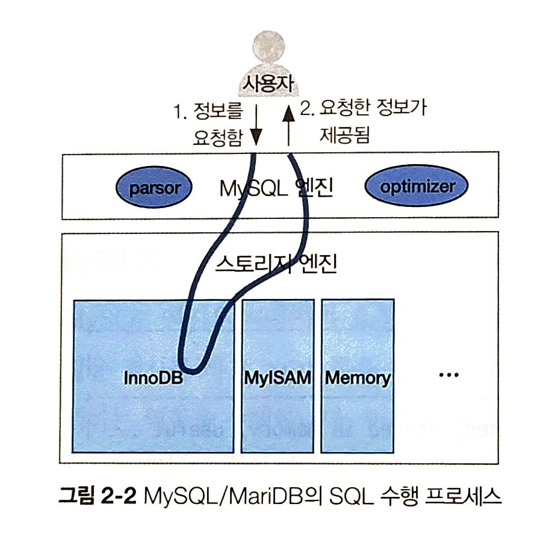
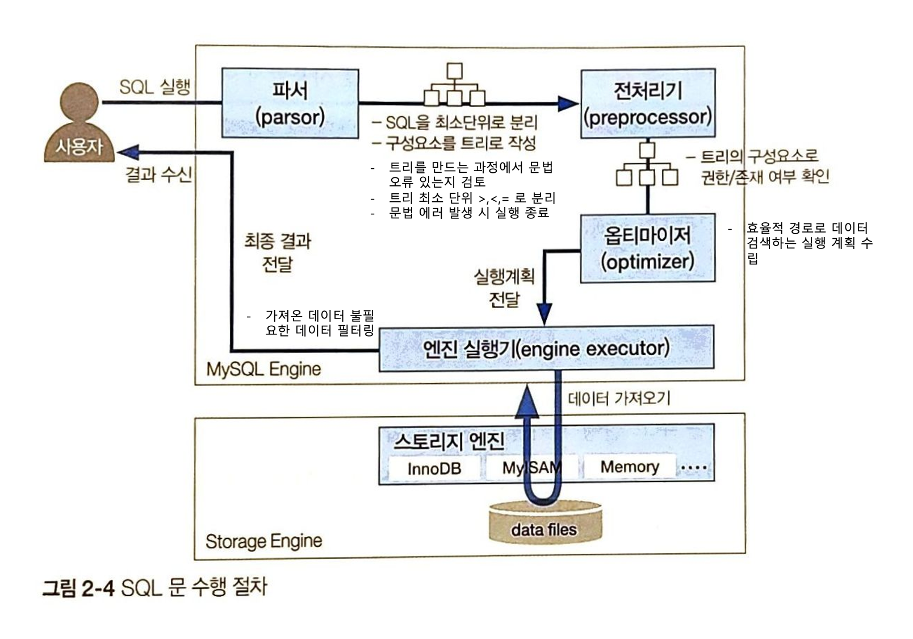

# 2장 SQL 튜닝 용어를 직관적으로 이해하기

## 2.1 물리 엔진과 오브젝트 용어
- DBMS를 구성하는 엔진들
- 내부 프로세스
- 데이터를 저장하는 오브젝트

<br>

### 2.1.1 DB 엔진 용어
- MySQL이라는 DBMS는 데이터를 저장하고, 저장된 데이터를 가공하는 연산을 수행

<br>

- 사용자는 DB에서 원하는 데이터를 가져오고자 SQL문을 실행
- **MySQL/MariaDB**
    - MySQL 엔진
        - 파서 (parser)
            - 파싱 작업을 함
            - 문법 에러가 있는지, DB에 존재하는 테이블 대상으로 SQL 문을 작성했는지 등을 다양한 문법 및 구문으로 검사
        - 옵티마이저 (optimizer)
            - 사용자가 요청한 데이터를 빠르고 효율적으로 찾아가는 전략적 계획을 수립
            - 이 계획을 토대로 스토리지 엔진에 위치한 데이터까지 찾아감
    - 스토리지 엔진
        - InnoDB
        - MyISAM
        - Memory

<div style="text-align: center;">
    
</div>

- 전체적인 흐름
    - 사용자가 정보를 요청 → 파싱 작업 및 에러 유무 확인 → 요청한 데이터 빠르게 찾아가는 계획 수립 → 스토리지 엔진에 위치한 데이터 찾아감 → 해당 데이터를 MySQL 엔진으로 전달 → MySQL 엔진은 전달된 데이터에서 불필요한 부분 필터링 및 필요한 연산 수행 → 사용자에게 최종 결과 제공

<br>

#### 스토리지 엔진
- 사용자가 요청한 SQL문을 토대로 `DB에 저장된 디스크나 메모리에서 필요한 데이터를 가져오는 역할`을 수행

- 분류
    - `스토리지 엔진이 데이터를 저장하는 방식`에 따라 구분
    - 필요하다면 외부에서 스토리지 엔진 설치 파일을 가져와 즉시 사용 가능

    <br>

    - InnoDB
        - 일반적인 경우
        - 온라인상의 트랜잭션 발생으로 데이터를 처리하는 OLTP 환경
    - MyISAM
        - 대량의 쓰기 트랜잭션이 발생하는 경우
    - Memory
        - 메모리 데이터를 로드하여 빠르게 읽는 효과를 내려는 경우

    <br>

    > **OLTP vs OLAP**
    > 
    > - OLTP (Online Transcation Processing)
    >   -  기본적인 목적
    >       - 데이터베이스 트랜잭션의 처리
    >   - '운영'계 데이터 및 데이터를 처리하는 방법
    >       - 주문을 처리하고, 재고를 업데이트하며, 고객 계정을 관리하는 데 사용
    >   - 복수의 사용자 PC에서 발생되는 트랜잭션을 DB 서버가 처리, 그 결과값을 요청한 사용자에게 되돌려주는 과정
    >   - 1개의 트랜잭션에서 발생되는 INSERT, UPDATE, DELETE를 무결성 보장하여 처리, 결과를 SELECT하는 과정
    > <br>
    > - OLAP (Online Analytical Procssing)
    >   -  기본적인 목적
    >       - 집계된 데이터를 분석
    >   - '분석'계 데이터 및 데이터를 처리하는 방법을 의미
    >       - 보고서를 생성하고, 복잡한 데이터 분석을 수행하며, 추세를 식별하는 데 사용
    >   - 데이터 웨어하우스(DW), DB에 저장되어 있는 데이터를 분석, 사용자에게 유의미한 정보를 제공해주는 처리 방법
    >   - 기존에 저장되어 있는 데이터를 사용자의 요구와 목적에 맞게 분석하여 정보를 제공하는 개념

<br>

#### MySQL 엔진
- SQL 문의 시작 및 마무리 단계에 관여, `스토리지 엔진으로부터 필요한 데이터만을 가져오는 핵심 역할`
- 역할
    - 사용자가 요청한 SQL 문을 넘겨받음
    - SQL 문법 검사와 적절한 오브젝트 활용 검사
    - SQL 문을 최소 단위로 분리하여 원하는 데이터를 빠르게 찾는 경로를 모색하는 역할
    - 이후 스토리지 엔진으로부터 전달받은 데이터를 대상으로 불필요한 데이터는 제거하거나 가공 및 연산하는 역할

<br>

### 2.1.2 SQL 프로세스 용어
- SQL 실행과정에서 핵심 역할 수행하는 `오브젝트`
- `MySQL 엔진에 포함`
<br>
    - **파서 (Parser)**
        - MySQL이 이해할 수 있는 최소 단위로 구성요소를 분리, 해당 구성요소를 `트리로 생성`
        - 트리를 만드는 과정에서 문법 오류가 있는지 검토
        - 트리의 최소 단위
            - <, >, = 등의 기호 or SQL 키워드
        - 트리에 혀용되지 않는 문법이 포함된다면 에러 발생과 동시에 실행이 종료
<br>
    - **전처리기 (Preprocessor)**
        - 생성된 트리 결과를 토대로 `유효성을 검증`
            - SQL문에 구조적인 문제가 없는지 파악
                - 이미 만들어진 테이블이나 뷰 등으로 구성되지 않는지
                - 존재하지 않는 열을 포함하지 않는지
                - 조회 권한이 없는 테이블을 조회하는지
        - 만약, 유효하지 않은 오브젝트가 있거나 권한이 없는 오브젝트를 호출하면 에러 발생
<br>
    - **옵티마이저 (Optimizer)**
        - DBMS의 두뇌
        - 트리를 구성하는 오브젝트의 데이터를 효율적으로 가져오기 위한 `실행 계획 수립`
            - 적은 시간, 효율적인 비용으로 데이터를 검색하는 방법
        - 전달된 파서 트리를 토대로 필요하지 않은 조건 제거, 연산 과정 단순화
        - 어떤 순서로 테이블에 접근할지, 인덱스를 사용할지, 사용한다면 어떤 인덱스를 사용할지, 정렬할 때 인덱스를 사용할지 아니면 임시 테이블을 사용할지 등 실행 계획 수립
        <br>
        - **단, 모든 실행 계획을 판단하지는 않음**
            - 이는 옵티마이저가 선택한 `최적의 실행 계획이 항상 최상의 실행 계획이 아닐 수 있는 것`을 의미
            - 실행 계획으로 도출할 수 있는 경우의 수가 너무 많은 경우
                - 계획 수립하고 비용 산정하는 시간이 오래걸림
                - 실행 계획을 수립하는 작업 자체만으로도 사용자의 대기시간과 하드웨어 리소스를 점휴하기 때문
            - **즉, 시간과 리소스에 제한을 두고 실행 계획을 산정해야 함**
                - 옵티마이저의 선택이 항상 최적이 아닌 만큼 사용자의 손길이 필요함
<br>
    - **엔진 실행기 (Engine Executor)**
        - MySQL 엔진과 스토리지 엔진 영역 모두에 걸침
        - 옵티마이저에서 `수립한 실행 계획으로 스토리지 엔진을 호출하여 필요한 데이터를 가져옴`
        - 가져온 후
            - 읽어온 데이터를 정렬하거나 조인
            - 불필요한 데이터를 필터링하는 추가 작업 수행
        - 따라서, MySQL 엔진의 부하를 줄이려면 스토리지 엔진에서 가져오는 데이터 양을 줄이는 것이 매우 중요

<div style="text-align: center;">
    
</div>

<br>

### 2.1.3 DB 오브젝트 용어
- **테이블 (Table)**
    - 데이터를 저장하는 오브젝트
    - 행과 열의 정보를 저장
    - RDB인 MySQL은 2차원 배열 형태로 테이블을 관리

<br>

- **행 (Row)**
    - 테이블에서 동일한 구조의 데이터 항목들의 집합
    - 모든 행의 집합이 테이블
    - 행 수가 많아지면 데이터에 접근하는 과정에서 시간이 오래 소요될 가능성이 높음
        - 이때, 파티셔닝 (Partitioning) 기법으로 SQL 문의 성능 향상 검토 가능

<!-- https://yunamom.tistory.com/291 -->

<br>

- **열 (Column)**
    - 사전에 정의한 데이터 유형으로 데이터 값을 저장
    - 열별로 다른 데이터 유형을 가질 수 있음

<br>

- **기본 키 (Primary Key)**
    - 특정 행을 대표하는 열
    - 보통 1개의 열로 이루어져 있지만, 상황에 따라 2개 이상의 열을 조합해 구성 가능
    - 인덱스 역할도 수행
    - MySQL / MariaDB
        - 기본 키는 `클러스터형 인덱스 (Clustered index)`로 작동
            - 기본 키의 구성 열 순서를 기준으로 물리적인 스토리지에 데이터가 쌓인다는 의미
                - 사전에서 가나다 순으로 찾기 좋게 정렬되어 있고, 책의 모서리에 ㄱ, ㄴ, ㄷ 이런 표시를 이용해서 찾을 수 있는 방식과 유사
            - 즉, 비슷한 기본 키 값들이 근거리에 적재됨
                - 기본 키를 활용하여 인덱스 스캔을 수행하면 테이블 데이터에 더 빠르게 접근 가능
    ```sql
    CREATE TABLE 학생 (
        학번 INT(11) NOT NULL,
        ...

        PRIMARY KEY(학번)
    );
    ```

<br>

- **외래 키 (Foreign Key)**
    - 외부에 있는 테이블을 항상 참조하면서, 외부 테이블의 데이터가 변경되면 함께 영향을 받는 관계를 설정하는 키
    - `외부 테이블: 부모 테이블`, `외부 테이블을 참조하는 테이블: 자식테이블` 이라고 생각
    ```sql
    CREATE TABLE 학생 (
        ...
        전공코드 CHAR(2)
        ...

        CONSTRAINT 학생_FK1 FOREIGN KEY(전공코드) REFERENCES 전공(전공코드)
    );
    ```

<br>

- **인덱스 (Index)**
    - 데이터베이스에서 키 값으로 실제 데이터 위치를 식별하고 데이터 접근 속도를 높이고자 생성하는 키 기준으로 정렬된 오브젝트
    - 처음부터 끝까지 전부 차례로 검색하는 비효율적인 방법 개선하고자 인덱스 생성
    - 생성하려는 열의 속성에 따라 `고유 인덱스(unique index)`와 `비고유 인덱스(non-unique index)`로 구분
        - 흔히 거론되는 인덱스: 비고유 인덱스
    <br>
    - **고유 인덱스(Unique index)**
        - 인덱스를 구성하는 열들의 데이터가 유일하다는 의미
        - 차례로 정렬되는 인덱스 열의 데이터는 서로 중복되지 않고 유일성을 유지
        - 동일한 데이터가 생성되면 고유 인덱스의 중복 체크 과정에서 에러 발생
        ```sql
        # 연락처: 학생 테이블의 열 (중복 불가)
        ALTER TABLE 학생
        ADD UNIQUE INDEX 연락처_인덱스(연락처);
        ```
        <br>

        > - **기본 키 vs 고유 인덱스**
        >   - 공통점
        >       - 데이터의 유일성을 보장하는 특성
        >       - 효율적인 데이터 접근을 위한 인덱스로의 수단으로 사용
        >   - 차이점
        >       - 기본 키는 Null 입력 불가
        >       - 고유 인덱스에는 Null 입력 가능

    <br>

    - **비고유 인덱스(Non-Unique index)**
        - 고유 인덱스에서 데이터의 유일한 속성만 제외한 키
        - 데이터가 신규 입력되어 인덱스가 재정렬되더라도 인덱스 열의 중복 체크를 거치지 않고 단순한 정렬 작업 수행
        ```sql
        # 이름: 학생 테이블의 열 (중복 가능)
        ALTER TABLE 학생
        ADD INDEX 이름_인덱스(이름);
        ```

<br>

- **뷰 (View)**
    - 가상 테이블
    - 물리적으로 잡히지 않는 유령 같은 오브젝트
    - 뷰를 사용하는 이유
        - 보안성
            - 일부 데이터에 대해서만 데이터를 공개
            - 노출에 민감한 데이터에 대해서는 제약을 설정
        - 여러 개의 테이블을 병합(Join)해서 활용할 떄는 성능을 고려한 최적화된 뷰를 생성하여 일관된 성능 제공 가능
    ```sql
    # 학생 테이블에는 학번, 이름, 생년월일, 연락처, 전공코드가 있지만 학번과 이름만 뷰로 생성하고 싶음
    CREATE VIEW 학생_뷰 AS
    SELECT 학번, 이름
    FROM 학생;
    ```

<br>

## 2.2 논리적인 SQL 개념 용어
- SQL 문 작성에 필요한 주변 오브젝트와 SQL 문의 상호관계, 연관성과 알고리즘에 관한 논리적 개념 용어

<br>

### 2.2.1 서브쿼리 위치에 따른 SQL 용어
- **메인 쿼리 (Main Query)**
    - 외부 쿼리 (Outer Query) 라고도 함
    - 가장 바깥쪽의 SELECT 문
- **서브 쿼리 (Subquery)**
    - 쿼리 안의 보조 쿼리
<br>
- SELECT 문 안쪽에 위치한 SELECT 문은 어느 위치에 작성되어있는지에 따라 용어가 달라짐
- **위치**
    - **SELECT 절**
        - 스칼라 서브쿼리 (Scalar Subquery)
        - 메인쿼리의 SELECT 절 내부에 하나의 숫자나 문자, 기호 등을 출력하는 SELECT 문
            - 결과 값은 1행 1열의 구조로 출력되어야 함
            - 보통 집계함수가 자주 쓰임
            ```sql
            SELECT 이름, 
                (SELECT COUNT(*)
                 FROM 학생 AS 학생2
                 WHERE 학생2.이름 = 학생1.이름) AS 카운트
            FROM 학생 AS 학생1;
            ```
    - **FROM 절**
        - 인라인 뷰 (Inline View)
        - 메인쿼리의 FROM 절 내부에 작성한 SELECT 문
            - 인라인 뷰의 결과는 내부적으로 메모리 또는 디스크에 임시 테이블을 생성하여 활용
            ```sql
            SELECT 학생2.학번, 학생2.이름
            FROM (SELECT *
                  FROM 학생
                  WHERE 성별 = '남') AS 학생2;
            ```
    - **WHERE 절**
        - 중첩 서브쿼리 (Nested Subquery)
        - 메인쿼리의 WHERE 절 내부에 작성한 SELECT 문
            - WHERE 절에서 단순한 값을 비교 연산하는 대신, 서브쿼리를 추가하여 비교 연산하기 위해 중첩 서브쿼리 사용
            - 보통 비교연산자(=, <, >, <=, >=, !=)
            - IN, EXISTS, NOT IN, NOT EXISTS 문을 많이 사용
            ```sql
            SELECT *
            FROM 학생
            WHERE 학번 = (SELECT MAX(학번)
                         FROM 학생)
            ```

<br>

### 2.2.2 메인쿼리와의 관계성에 따른 SQL 용어
- 서브쿼리와 메인쿼리의 관계성에 따른 SQL 용어
- 서브쿼리는 그 자체가 독립적인 형태로 존재 가능, 메인쿼리와 끈끈한 관계를 유지하며 존재 가능

<br>

- **비상관 서브쿼리 (Non correlated subquery)**
    - 메인쿼리와 서브쿼리 간에 관계성이 없음
    - 서브쿼리가 독자적으로 실행된 뒤, 메인쿼리에게 결과를 던져주는 형태
    - 요약
        - 비상관 서브쿼리에서는 서브쿼리가 먼저 실행된 뒤, 그 결과를 메인쿼리가 활용
        - 서브쿼리 실행 → 메인쿼리 실행 순서

        ```sql
        # 성별 = '남' 조건으로 학생 테이블에서 데이터를 가져온 뒤
        # 그 결과를 메인쿼리의 학생 테이블로 전달하여 최종 결과를 출력
        # 이때 DB 버전 및 옵티마이저에 따라 서브 쿼리가 제거되고 하나의 메인쿼리로 통합되는 뷰 병합 (View merging)
        # 즉, SQL 재작성 (SQL rewrite)가 작동될 수 있음
        SELECT *
        FROM 학생
        WHERE 학번 IN (SELECT 학번
                        FROM 학생
                        WHERE 성별 = '남')
        ```

<br>

- **상관 서브쿼리 (Correlated subquery)**
    - 메인쿼리와 서브쿼리 간에 관계성이 있음
    - 서브쿼리가 수행되려면 메인쿼리의 값을 받아야하므로 서브쿼리와 메인쿼리는 서로 끈끈한 관계를 유지
    - 요약
        - 스칼라 서브쿼리 (SELECT 절), 중첩 서브쿼리 (WHERE 절) 일 때 발생
        - 메인쿼리에서 데이터 전달 받음 → 서브쿼리 수행 → 결과 다시 메인쿼리에 전달
        ```sql
        # 메인 쿼리에서 학생 테이블의 학번 결과를 서브쿼리로 전달 → 지도교수 테이블의 학번과 비교
        # 즉, 지도교수 테이블의 학번과 학생 테이블의 학번이 동일할 때만 서브쿼리의 결과로 도출
        # 이렇게 도출된 서브쿼리의 학번 결과를 메인쿼리의 학번과 비교해 최종결과를 출력
        
        # 실행순서
        # 메인쿼리 실행(학생.학번 데이터 가져오기) → 서브쿼리 실행(지도교수.학번 = 학생.학번) → 다시 메인쿼리 실행한 뒤 결과 출력 (SELECT * FROM 학생 ~)
        
        # 이때 DB 버전 및 옵티마이저에 따라 서브 쿼리가 제거되고 하나의 메인쿼리로 통합되는 뷰 병합 (View merging)
        # 즉, SQL 재작성 (SQL rewrite)가 작동될 수 있음
        SELECT *
        FROM 학생
        WHERE 학번 IN (SELECT 학번
                      FROM 지도교수
                      WHERE 지도교수.학번 = 학생.학번)
        ```

<br>

### 2.2.3 반환 결과에 따른 SQL 용어
- 서브쿼리의 결과 유형은 수치적 기준으로 구분 가능
    - 단순히 1건의 행 데이터만 반환하는 경우
    - 2개 이상의 행 데이터를 반환하는 경우
    - 2개 이상의 행과 열 데이터를 반환하는 경우

<br>

- **단일행 서브쿼리 (Single-row subquery)**
    - 서브쿼리 결과가 1건의 행으로 반환되는 쿼리
    - 그에 따라 메인쿼리의 조건절에서는 =, <, > 등의 연산자와 비교
    - 주로 SELECT 절에 사용하는 스칼라 서브쿼리와 동일
    ```sql
    # 학생 테이블에서 학번의 최대값을 조회 → 항상 하나의 값만 반환 → 메인쿼리 수행 및 최종 결과 출력
    WHERE 학번 = (SELECT MAX(학번)
                 FROM 학생)
    ```

<br>

- **다중행 서브쿼리 (Multiple-row subquery)**
    - 서브쿼리 결과가 여러 건의 행으로 반환되는 쿼리
    - 그에 따라 메인쿼리의 조건절에서는 IN 구문으로 서브쿼리에서 반환되는 값들을 받음
    ```sql
    # 학생 테이블에서 전공코드별 학번 최댓값을 반환 → 전공코드의 종류만큼 학번의 최댓값들이 반환 → 메인쿼리 수행 및 최종 결과 출력
    WHERE 학번 IN (SELECT MAX(학번)
                  FROM 학생
                  GROUP BY 전공코드)
    ```

<br>

- **다중 열 서브쿼리 (Multiple-column subquery)**
    - 서브쿼리 결과가 여러 개의 열과 행으로 반환되는 쿼리
    - 그에 따라 메인쿼리의 조건절에서는 IN 구문과 함께 서브쿼리에서 반환된 열들을 동일하게 나열해 서브쿼리 결과를 받음
    ```sql
    # 학생 테이블에서 이름이 '김'으로 시작하는 학생의 이름과 전공 코드를 반환 → 메인쿼리에서 반환되는 열들과 동일하게 결과를 받음 → 메인쿼리 수행 및 최종결과 출력
    WHERE (이름, 전공코드) IN (SELECT 이름, 전공코드
                            FROM 학생
                            WHERE 이름 LIKE '김%')
    ```