# 3장 SQL 튜닝의 실행계획 파헤치기

## 3.1 데이터 세팅

- ##### show tables
   

<br>

## 3.2 실행 계획 수행
- 실행 계획
    - `SQL 문으로 요청한 데이터를 어떻게 불러올 것인지`에 관한 계획

<br>

### 3.2.1 기본 실행 계획 수행
- 실행계획 확인 키워드
    ```sql
    EXPLAIN SQL 문;
    DESCRIBE SQL 문;
    DESC SQL 문;
    ```
    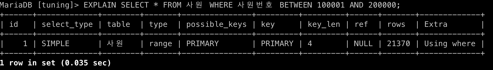

<br>

### 3.2.2 기본 실행 계획 항목 분석
- **id**
    - `실행 순서를 표시`하는 숫자
    - SQL 문이 수행되는 차례를 ID로 표기, 조인할 때는 똑같은 ID가 표시됨
    - 즉, ID의 숫자가 작을수록 먼저 수행된 것이고, 같으면 조인이 이루어진 것

    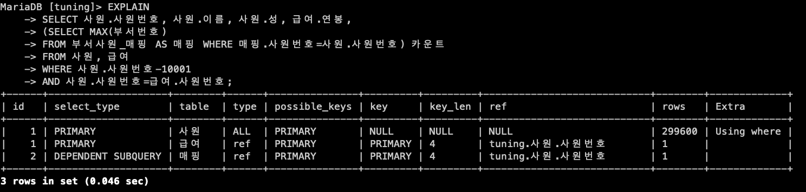

<br>

- **select_type**
    - `SQL 문을 구성하는 SELECT 문의 유형을 출력`하는 항목

    <br>

    - **SIMPLE**
        - union 이나 내부 쿼리가 없는 select 문을 의미
        - 단순한 select 구문으로 작성된 경우

        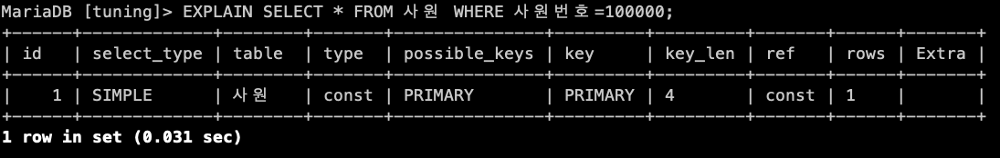
    
    <br>

    - **PRIMARY**
        - 서브쿼리가 포함된 SQL 문이 있을 때 첫 번째 SELECT 문에 해당하는 구문에 표시되는 유형
        - 서브쿼리를 감싸는 외부 쿼리
        - union이 포함된 SQL 문에서 첫 번째로 SELECT 키워드가 작성된 구문에 표시

        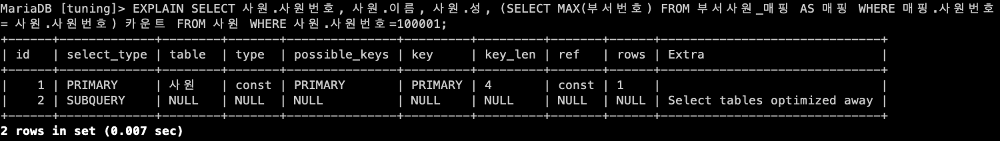
    
    <br>

    - **SUBQUERY**
        - 독립적으로 수행되는 서브쿼리

        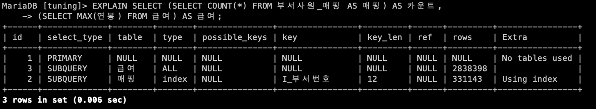

    <br>

    - **DERIVED**
        - FROM 절에 작성된 서브쿼리
        - 즉, FROM 절의 별도 임시 테이블인 인라인 뷰를 말함

        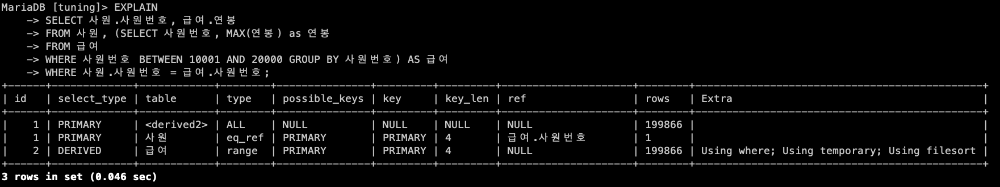

    <br>

    - **UNION**
        - union 및 union all 구문으로 합쳐진 select 문에서 첫번째 select 구문을 제외한 이후의 select 구문에 해당한다는 걸 나타냄
        - union 구문의 첫 번째 select 절은 primary 유형으로 출력됨

        

    <br>
    
    - **UNION RESULT**
        - union all이 아닌 union 구문으로 select 절을 결합했을 때 출력
        - union은 출력 결과에 중복이 없는 유일한 속성을 가짐
            - 각 select 절에서 데이터를 가져와 정렬하여 중복체크하는 과정을 거침
        - 즉, union result는 별도의 메모리 또는 디스크에 임시 테이블을 만들어 중복을 제거하겠다는 의미로도 해석 가능

        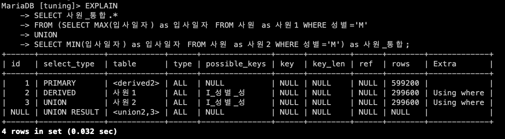

    <br>

    - **DEPENDENT SUBQUERY**
        - union 또는 union all을 사용하는 서브쿼리가 메인 테이블의 영향을 받는 경우
        - union으로 연결된 단위 쿼리들 중에서 처음으로 작성한 단위 쿼리에 해당되는 경우
        - 즉, union으로 연결되는 첫 번째 단위 쿼리가 독립적으로 수행하지 못하고 메인 테이블로부터 값을 하나씩 공급받는 구조이므로 성능적으로 불리 -> SQL 튜닝 대상

        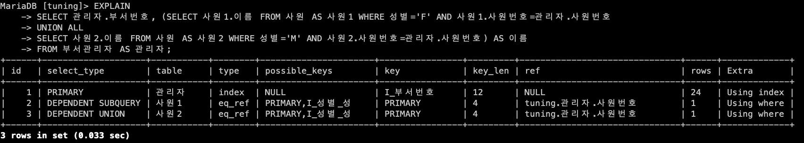

    <br>

    - **DEPENDENT UNION**
        - union 또는 union all을 사용하는 서브쿼리가 메인 테이블의 영향을 받는 경우
        - union으로 연결된 단위 쿼리 중 첫 번째 단위 쿼리를 제외하고 두 번째 단위 쿼리에 해당되는 경우
        - 즉, union으로 연결되는 두 번째 이후의 단위 쿼리가 독립적으로 수행하지 못하고 메인 테이블로부터 값을 하나씩 공급받는 구조이므로 성능적으로 불리 -> SQL 튜닝 대상

        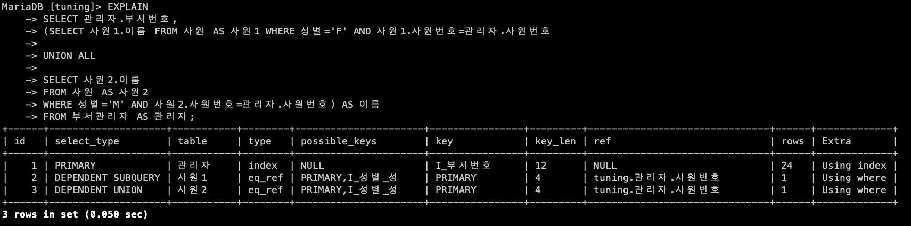

    <br>

    - **UNCACHEABLE SUBQUERY**
        - 메모리에 상주하여 재활용되어야 할 서브쿼리가 재사용되지 못할 때 출력되는 유형
            - 해당 서브쿼리 안에 사용자 정의 함수나 사용자 변수가 포함되거나
            - RAND(), UUID() 함수 등을 사용하여 매번 조회 시마다 결과다 달라지는 경우에 해당
        - 만약, 자주 호출되는 SQL 문이라면 메모리에 서브쿼리 결과가 상주할 수 있도록 변경하는 방향으로 SQL 튜닝 검토 가능

        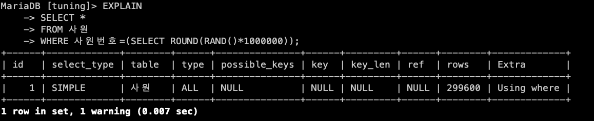

    <br>

    - **MATERIALIZED**
        - IN 절 구문에 연결된 서브쿼리가 임시 테이블을 생성한 뒤,
        - 조인이나 가공 작업을 수행할 때 출력되는 유형
        - 즉, IN 절의 서브쿼리를 임시 테이블로 만들어서 조인 작업을 수행하는 것

        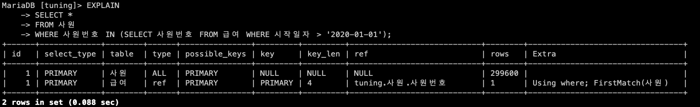

<br>

- **table**
    - `테이블 명을 표시`하는 항목
    - 실행 계획 정보에서 테이블 명이나 테이블 별칭을 출력
    - 서브쿼리나 임시 테이블을 만들어서 별도의 작업을 수행할 때는 <subquery#> 나 <derived#> 라고 출력됨

    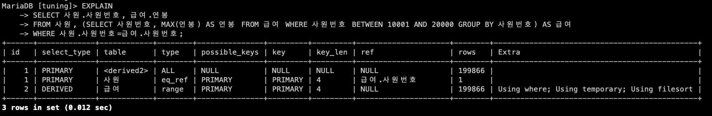

<br>

- **partitions**
    - `실행 계획의 부가정보`로, `데이터가 저장된 논리적이 영역을 표시`하는 항복
    - 사전의 정의한 전체 파티션 중 특정 파티션에 선택적 접근하는 것이 SQL 성능 측면에서 유리

<br>

- **type**
    - `테이블의 데이터를 어떻게 찾을지에 대한 정보를 제공`하는 항목
    - 테이블을 처음부터 끝까지 전부 확인할지, 인덱스를 통해 바로 데이터를 찾아갈지 등을 해석
    
    <br>

    - **system**
        - 테이블에 데이터가 없거나 한 개만 있는 경우
        - 성능상 최상의 type

        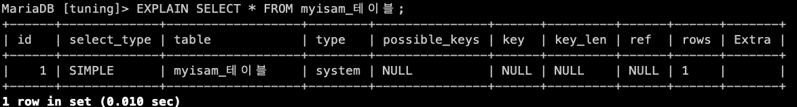

    <br>

    - **const**
        - 조회되는 데이터가 단 1건일 때 출력되는 유형
        - 성능상 매우 유리
        - 고유 인덱스나 기본 키를 사용하여 단 1건의 데이터에만 접근하면 되므로 속도나 리소스 사용 측면에서 지향해야 할 타입

        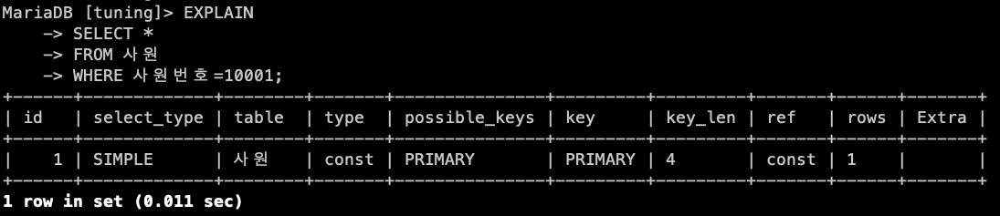
    
    <br>

    - **eq_ref**
        - 조인이 수행될 때 드리븐 테이블의 데이터에 접근하여 고유 인덱스 또는 기본 키로 단 1건의 데이터를 조회하는 방식
        - 드라이빙 테이블과의 조인 키가 드리븐 테이블에 유일하므로 조인이 수행될 때 성능상 가장 유리한 경우 

        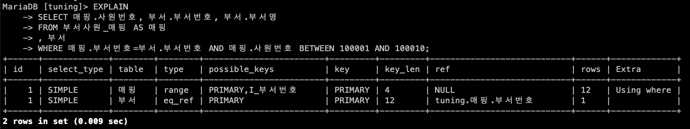

    <br>

    - **ref**
        - 조인을 수행할 때 드리븐 테이블의 데이터 접근 범위가 2개 이상인 경우
        - 즉, 드라이빙 테이블과 드리븐 테이블이 조인을 수행하면 일대다 관계가 됨
            - 드라이빙 테이블의 1개 값이 드리븐 테이블에서는 2개 이상의 데이터로 존재

        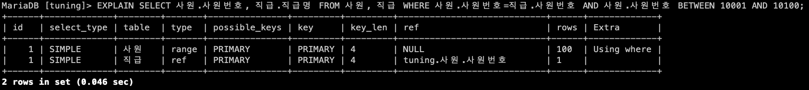
    
    <br>

    - **ref_or_null**
        - ref 유형과 유사하지만 IS NULL 구문에 대해 인덱스를 활용하도록 최적화된 방식
        - 테이블에서 검색할 NULL 데이터 양이 적다면 ref_or_null 방식을 활용했을 때 효율적인 SQL 문이 될 것이나 검색할 NULL 데이터양이 많다면 SQL 튜닝의 대상이 될 것

        
    
    <br>

    - **range**
        - 테이블 내의 연속된 데이터 범위를 조회하는 유형
        - 주어진 데이터 범위 내에서 행 단위로 스캔하지만, 스캔할 범위가 넓으면 성능 저하의 요인이 될 수 있으므로 SQL 튜닝 검토 대상이됨

        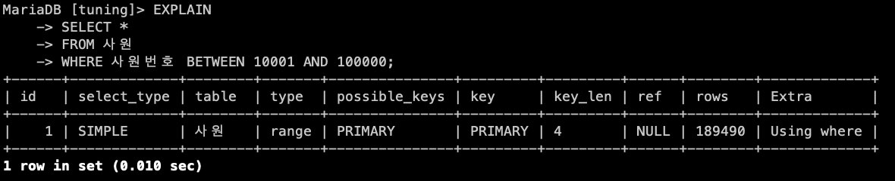
    
    <br>

    - **fulltext**
        - 텍스트 검색을 빠르게 처리하기 위해 사용
        - 전문 인덱스(full text index)를 사용하여 데이터에 접근하는 방식

    <br>

    - **index_merge**
        - 결합된 인덱스들이 동시에 사용되는 유형
        - 즉, 특정 테이블에 생성된 두 개 이상의 인덱스가 병합되어 동시에 적용됨

        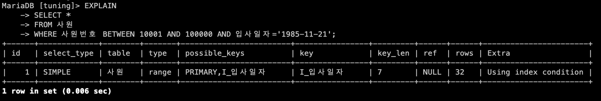
    
    <br>

    - **index**
        - 인덱스 풀 스캔을 의미
        - 즉, 물리적인 인덱스 블록을 처음부터 끝까지 훓는 방식

        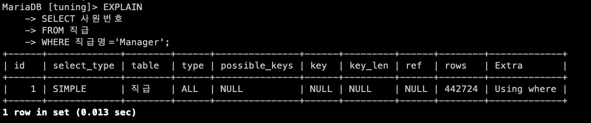

    <br>

    - **all**
        - 테이블 풀 스캔 방식
        - 활용할 수 있는 인덱스가 없거나, 인덱스를 활용하는게 오히려 비효율적이라고 옵티마이저가 판단하는 경우 

        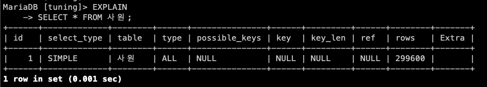
    
<br>

- **possible_keys**
    - `옵티마이저가 SQL 문을 최적화하고자 사용할 수 있는 인덱스 목록을 출력`
    - 다만 실제 사용한 인덱스가 아닌, 사용할 수 있는 후보군의 기본키와 인덱스 목록만 보여줌
        - SQL 튜닝의 효용성은 없음

<br>

- **key**
    - 옵티마이저가 `SQL 문을 최적화하고자 사용한 기본 키 또는 인덱스 명`
    - 어느 인덱스로 데이터를 검색했는지 확인 가능
    - 비효율적인 인덱스를 사용했거나 인덱스 자체를 사용하지 않았다면 튜닝 대상이 됨

    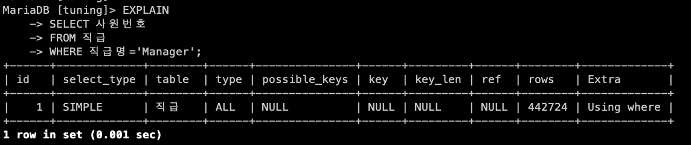

<br>

- **key_len**
    - 인덱스를 사용할 때는 인덱스 전체를 사용하거나 일부 인덱스만 사용
    - key_len은 `사용한 인덱스의 바이트 수`를 의미
        - INT - 단위 당 4바이트
        - VARCHAR - 단위 당 3바이트

    

<br>

- **ref**
    - `테이블 조인을 수행할 때 어떤 조건으로 해당 테이블에 액세스되었는지` 알려주는 정보
    
    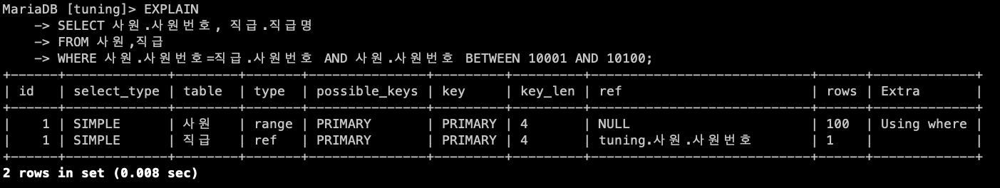

<br>

- **rows**
    - SQL 문을 수행하고자 `접근하는 데이터의 모든 행 수를 나타내는 예측 항목`
    - 즉, 디스크에서 파일을 읽고 메모리에서 처리해야 할 행 수를 예상하는 값
    - 수시로 변동되는 MySQL의 통계정보를 참고하여 산출하는 값이므로 수치가 정확하진 않음

<br>

- **filtered**
    - SQL 문을 통해 `DB 엔진으로 가져온 데이터 대상으로 필터 조건에 따라 어느 정도 비율로 데이터를 제거했는지를 의미`하는 항목
    - 단위는 %

<br>

- **extra**
    - `SQL 문을 어떻게 수행할 것인지에 관한 추가 정보`를 보여주는 항목
    - 부가적인 정보들은 (;)으로 구분하여 여러 가지 정보를 나열할 수 있음

<br>

### 3.2.3 좋고 나쁨을 판단하는 기준
- 실행 계획을 수행하여 출력된 정보를 살펴보고 SQL 튜닝 대상인지 판단하기는 어려움
- 하지만, 다음과 같은 기준은 참조할 수 있음
- 이때, 검토 대상인 실행 계획 열은 `select_type, tpye, extra`임

<br>

- **select_type**
    - 좋음
        - SIMPLE, PRIMARY, DERIVED
    - 나쁨
        - DEPENDENT *, UNCACHEABLE *

<br>

- **type**
    - 좋음
        - system, const, eq_ref
    - 나쁨
        - index, all

<br>

- **extra**
    - 좋음
        Using index
    - 나쁨
        - Using filesort, Using temporary

<br>

### 3.2.4 확장된 실행 계획 수행
- EXPLAIN 보다 추가 정보를 확인하고자 한다면 DB에서 지원하는 키워드로 확인 가능

<br>

#### MariaDB의 확장된 실행 계획 수행
- **EXPLAIN PARTITIONS**
    - 파티션으로 설정된 테이블에 대해 접근 대상인 파티션 정보를 출력

    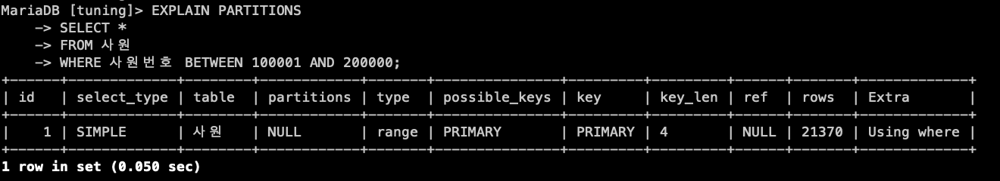

<br>

- **EXPLAIN EXTENDED**
    - 스토리지 엔진에서 가져온 데이터를 다시 MySQL 엔진에서 추출한 비율인 filtered 열의 값을 추가로 출력

    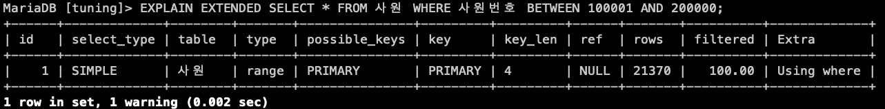

<br>

- **ANALYZE**
    - 실제 액세스한 데이터 건수와 MySQL 엔진에서 가져온 데이터에서 추가로 추출한 데이터의 비율을 확인 가능

    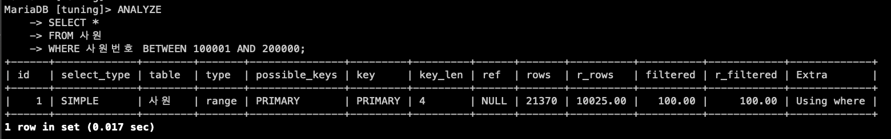

<br>

### 3.3 프로파일링
- **프로파일링**
    - `SQL 문에서 문제가 되는 병목 지점을 찾고자 사용하는 수단이나 툴`
    - 느린 쿼리나 문제가 있다고 의심되는 SQL 문의 원인을 확인 가능

<br>

### 3.3.1 SQL 프로파일링 실행하기
- 프로파일링 활성화

    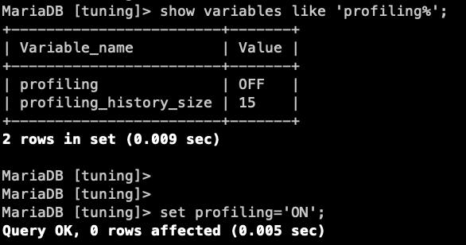

<br>

- 특정 쿼리 ID에 대해서만 프로파일링된 상세 내용 확인하기
    ```sql
    show profile for query #;
    ```
    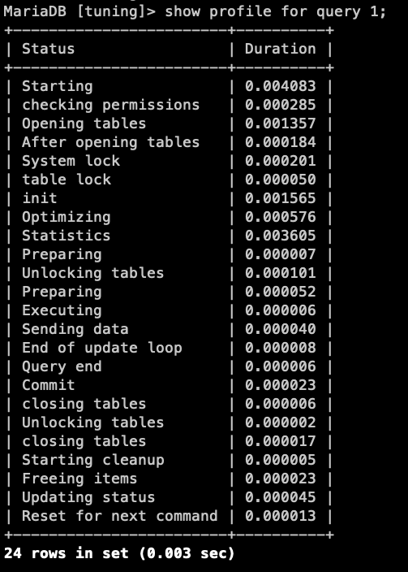

<br>

### 3.3.2 프로파일링 결과 해석하기
- 결과 확인
    - 항목별 의미를 파악하고, 각 항목마다 원인과 해결책 도출 가능
    - 여러 키워드를 통해 Block I/O나 CPU, SWAP 횟수 등에 대한 OS 수준의 확장된 정보를 제공 받을 수 있음

    <br>

    ```sql
    # all - 제공할 수 있는 프로파일링 정보를 모두 출력
    show profile all for query 1;

    # cpu - SQL 수행 단계별로 점유한 CPU 양을 출력
    show profile cpu for query 1;

    # io - 데이터 접근 단위인 블록 수준의 입력과 출력에 관한 정보를 추가 출력
    show profile io for query 1;
    ```

<br>

### 3.4 마치며
- 실행계획 해석하는 법
- SQL 문의 수행을 분석할 수 잇는 다양한 툴(실행계획, 프로파일링) 들이 존재하지만,
- 보통 제한된 업무 조건에서 튜닝을 수행하므로 `예측된 실행 계획정보를 기준`으로 튜닝을 진행 